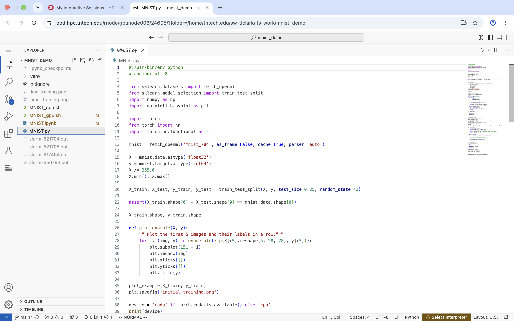
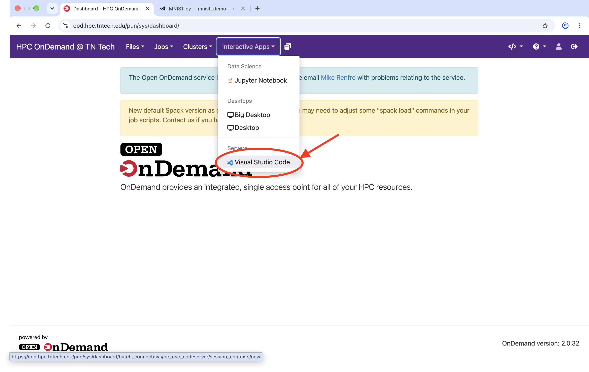
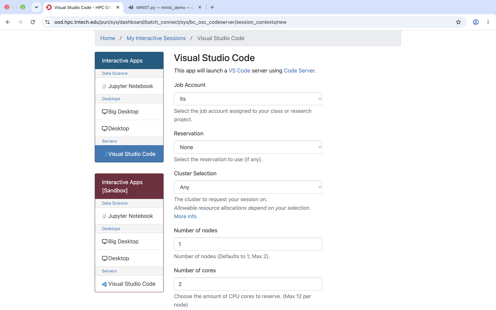
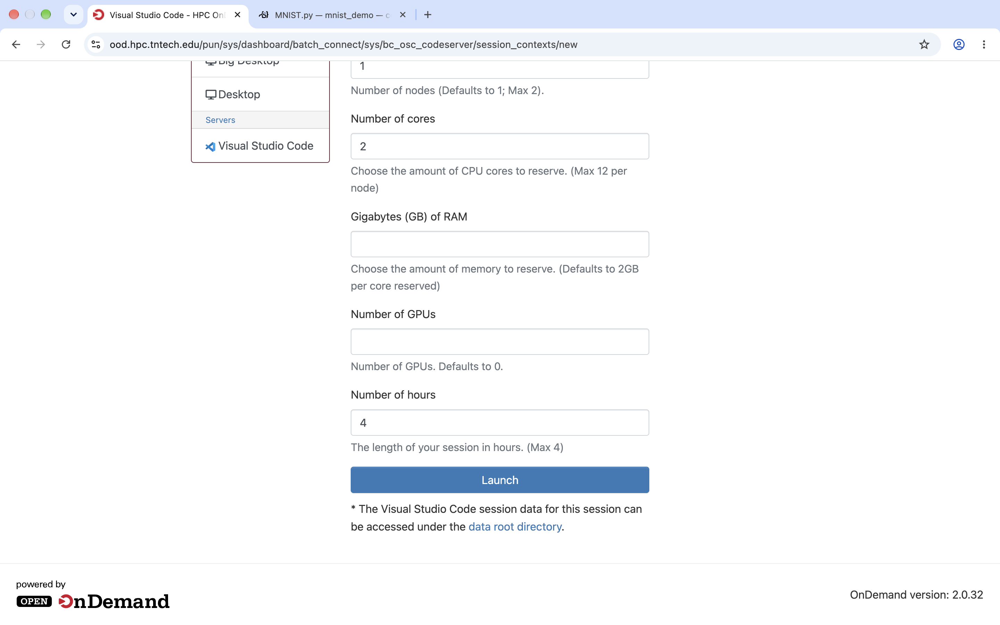

# Overview

[code-server](https://coder.com/docs/code-server) is an offering
from [Coder](https://coder.com/) that allows effectively a [Visual
Studio Code](https://code.visualstudio.com/) instance within your browser.

From here on, this document will refer to code-server as Visual Studio Code
or VS Code. Just know that the underlying mechanisms in place run on the
code-server.

_note:_ After preliminary testing, we found Google Chrome yields better
results than other browers. If you are having reponsiveness issues, try
using Google Chrome.

# Usage

## Requesting a Session

In order begin a VS Code session, you must make a request in Open On
Demand's "Interactive Apps" section.

To do so, navigate to <https://ood.hpc.tntech.edu/> and navigate to
"Interactive Apps" -> Visual Studio Code.

Following this, you should find a number of fields to fill out, described below:

- Job Account
  - This name or number should match the class or project that you have been assigned to
- Cluster Selection
  - This can be adjusted to pin your VS Code session on either the Impulse or Warp 1
    cluster if desired
- Number of Nodes
  - This describes how many nodes your VS Code session will run on
  - For developing programs that need utilize multiple nodes, you may request
    up to two
  - If you are unsure how many nodes you need, select one
- Number of Cores
  - This describes the total amount of CPU cores your session will use
  - For the purposes of this document, this is equivalent to SLURM's
    `--ntasks` parameter
- Number of GPUs
  - If your job requires a GPU you may request one or more depending on your
    cluster selection
- Number of hours
  - This describes how long your VS Code session will last
  - While your session can only last up to four hours, nothing
    is stopping you from requesting another session once one finishes
  - If you need longer than four hours, feel free to contact us at
    <https://www.rcd.tntech.edu/contact/> and we will be happy to
    work with you

_Note:_ If you have set up a reservation with us, you will see
a "Reservation" section. There, you can select which reservation
to request your session on.

