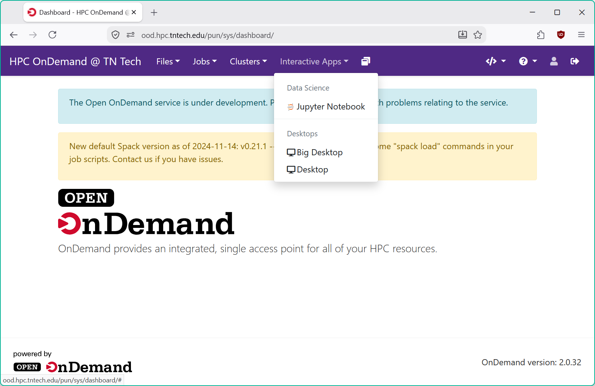

# Overview

Tennessee Tech's HPC clusters support desktop environments for special-purpose applications.
This service provides the capabilities to run graphical applications through a GUI accessible to
your web browser.

## Usage

First, head on over to Open OnDemand: <https://ood.hpc.tntech.edu>

Once you sign in, under the "Interactive Apps" dropdown, you will find two options under "Desktops,"
Desktop and Big Desktop.

The differences between the two boil down to which slurm partition your graphical session runs under.
The Desktop configuration runs your session an interactive partition, leading to much faster
queue times, but with more restrictions on resource acquisition. For jobs that require more than the
maximum allowed resources in an interactive partition, you can use Big Desktop to run under either `batch-warp`
or `batch-impulse`. While using these partitions allow for more resource usage, you may find
that there are longer queuing times.

_If you are at all unsure about which configuration to use, choose the regular Desktop._

### Desktop Configuration
